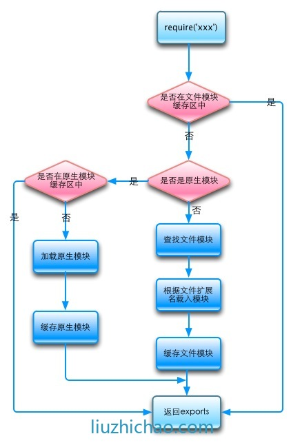

#[【NodeJS 教程】](https://nqdeng.github.io/7-days-nodejs/)


> 主API

```
Node.js 提供来丰富的api。几个主要的
1、文件操作(fs,path,fileSystem, stream, Buffer)
2、网络操作（http,https,url,querystring, zlib, net）
3、进程管理(process, child_process)
```


> 模块（__filename,__dirname, require, exports, module）


* 常用模块

```
os：返回当前系统的一些数据	  - 系统相关
path：对路径做的一些操作	  - 文件路径读写
http：可以创建web服务器对象等 - 网络数据读写
fs：针对文件进行读写等操作	  - 本地数据读写
```

* 导出模块

```
一个模块可以通过module.exports或exports将函数、变量等导出,它们指向同一个空对象。
module.exports才是真正的接口，exports只不过是它的一个辅助工具。
<==> var exports = module.exports

exports.hello = function () {
    console.log('Hello World!');
};
或
module.exports = { 
	foo: 'foo', 
	fn: function(){

	} 
}
```

* 引入模块

```
var foo1 = require('./foo');     相对路径,必须以 ./ 开头
var _ = require('underscore');   node_module 内
var jquery = require('d:/foo');  绝对路径
```

* 模块安装

```
npm install 包名
npm uninstall 包名
npm update 包名
npm search 包名
npm help 命令
```

>事件监听

```
eventEmitter.on("事件名字",函数)   绑定事件及事件的处理函数
eventEmitter.emit(“事件名字”)   触发事件
```


> 异步编程[（co、async、Q 、『es6原生promise』、then.js、bluebird）](https://www.zhihu.com/question/25413141)

```
then.js 简单，与async比，链式API更流畅
ES6 Promise, Q, Bluebird 核心都是 Promise
co 则是利用 ES6中 generator 的异步解决方案
yield,await/async 中以等待让异步返回一个值，再进行
yield 是ES6 特性
await/async 是ES7 特性
```


####其它

> stream 一般处理大文件，避免内存“爆仓”

```
正常的情况应该是，写完一段，再读取下一段，如果没有写完的话，就让读取流先暂停，等写完再继续,否则如果写入的速度跟不上读取的速度，有可能导致数据丢失。


var fs = require('fs');
var readStream = fs.createReadStream('/path/to/source');
var writeStream = fs.createWriteStream('/path/to/dest');

readStream.on('data', function(chunk) { // 当有数据流出时，写入数据
	if (writeStream.write(chunk) === false) { // 如果没有写完，暂停读取流
		readStream.pause();
	}
});

writeStream.on('drain', function() { // 写完后，继续读取
	readStream.resume();
});

readStream.on('end', function() { // 当没有数据时，关闭数据流
	writeStream.end();
});


or


pipe自动调用了data,end等事件
fs.createReadStream('/path/to/source').pipe(fs.createWriteStream('/path/to/dest'));
```

> 使用 ES6

```
a)    安装es-checker  - npm -g install es-checker 检测当前node对es6支持情况
b)    babel的安装 npm -g  install babel-cli && npm  --save-dev install babel-cli
c)    安装babel-preset-es2015  npm install --save-dev babel-preset-es2015
d)    测试es6代码
```


> 使用 ES7 草案

```
a)    babel-cli
b)    babel-preset-es2015"
c)    babel-preset-react":
d)    babel-preset-stage-3
e)    babel-polyfill
```


> 异步调用

```
构建一个应用程序总是会面对异步调用，不论是在 Web 前端界面，还是 Node.js 服务端都是如此，JavaScript 里面处理异步调用一直是非常恶心的一件事情。以前只能通过回调函数，后来渐渐又演化出来很多方案，最后 Promise 以简单、易用、兼容性好取胜，但是仍然有非常多的问题。其实 JavaScript 一直想在语言层面彻底解决这个问题，在 ES6 中就已经支持原生的 Promise，还引入了 Generator 函数，终于在 ES7 中决定支持 async 和 await。
```


> require 查找策略，是会进行加载的模块进行缓存的，不会有重复开销
<p>
	
</p>